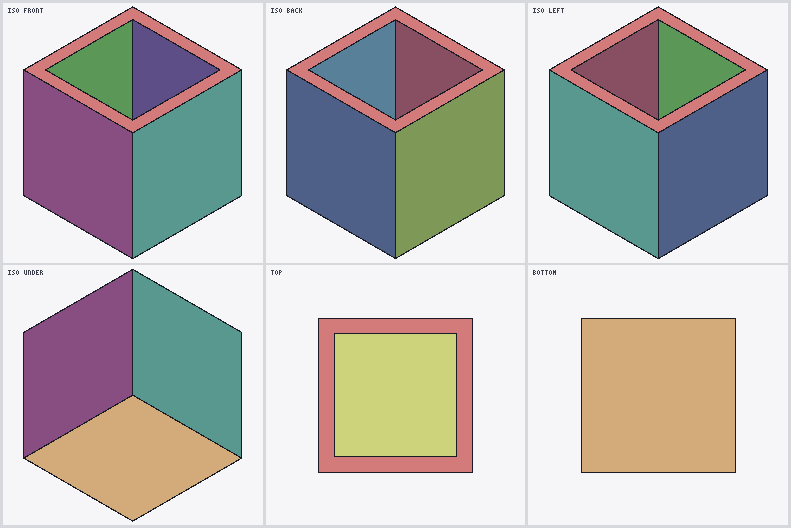
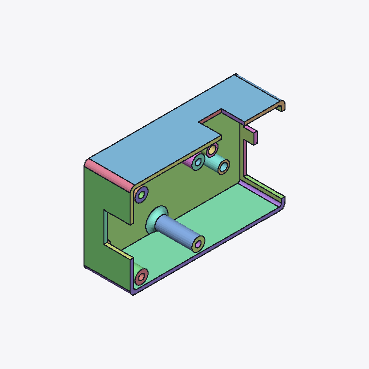

# SLDPRT Format Research — Working Dump

**Latest, 2026-09-16:** [v0.4.8 / EXP-042–051](v0.4.8/README.md) decodes the triangle-strip layout, Block1 edge-ID annotations, Block2 section lengths and the downstream metadata relationship on the modern corpus, then validates that decode three independent ways — against externally exported STEP, through a second face-discovery path with a falsification control, and visually. [parser/v0.2](parser/v0.2/README.md) implements the validated read-only path. This supersedes the old “loop size” interpretation; full exact B-rep and several metadata semantics remain open. All work goes to `staging`; the user merges to `main`.

This repository is a working dump of all local research files for the SLDPRT reverse-engineering project. It mirrors the local working directory and is used to back up experiments, evidence, and knowledge as they are produced.

**Main research repo:** [sldprt-format-research](https://github.com/blussyya/sldprt-format-research)

## What's Decoded

Two layers of the `Contents/DisplayLists` per-face record are now read end to end, and the
link between them is explicit:

- **A precursor array** `[4,8,2,S]` immediately before the positions stores the **triangle-strip
  vertex counts** directly, one entry per strip, summing to the face's vertex count (INV-020).
  This is what `parser/v0.2` reads as `stripLengths`.
- **Block2** is the **Block1 section-length table**, one entry per strip, storing `2·L − 2` — the
  strip's leading control word plus its `2L − 3` edge tokens — and summing to Block1's word count
  (INV-018). A strip length is recoverable from it as `(Block2[i] + 2) / 2`, which is INV-007's
  decode and what `parser/v0.1` used; what that decode yields is strip vertex counts, not the CAD
  boundary-loop sizes the old `loopSizes` name implied. **Block2's stored words are not strip
  lengths** — every stored word exceeds its strip length (`2L − 2` against `L`, for the observed
  `L ≥ 3`), so reading them as lengths produces invalid triangle indices.
- **Block1** is a **per-edge annotation array** over those strips: one control word per strip,
  then one token per strip edge. Zero marks a face-interior edge, nonzero a face-boundary edge,
  and the nonzero IDs are shared with the adjoining face (INV-021, INV-024).
- This *explains* INV-016/017 rather than restating them: a strip of L vertices has exactly
  2L−3 edges, so `b1Len = 2 × (vc − secCount)` falls out of the strip model.
- A third byte array (Block3, INV-022) and a forward metadata grammar reaching the surface
  record and edge table (INV-023) are documented but not fully decoded.

Still open: exact B-rep, feature history, `Config-0-Partition`, Block3 semantics, the optional
scalar arrays, and surface tags 4005/4006/4007/4009 — the controlled corpus covers only planes
and cylinders, recorded as NQ-030. Legacy OLE2 containers remain unsupported.

## Using the tools

Node.js only. **No dependencies to install** — no npm install, no build step, nothing fetched at
runtime. Everything below runs from a fresh clone. Legacy OLE2 parts are unsupported throughout
and report `No readable modern DisplayLists stream`.

### 1. Parse a part file

```bash
node parser/v0.2/src/node-cli.js "test files original/controlled/C04_cube_hole_5mm/model.SLDPRT" > parsed.json
```

Prints the whole decode as JSON — one object per face carrying `stripLengths`, `vertices`,
`normals`, `triangleIndices`, `edgeAnnotations` (the INV-021 per-edge tokens), `block1/2/3`,
`boundaryCycles` and the forward `metadata` with its surface tag and parameters. Byte `offsets`
are included per face so any claim can be checked against the file itself. Exits nonzero if any
face failed.

Validation:

```bash
node parser/v0.1/test/run-corpus-tests.js   # 1,172/1,172 faces, parity with the v0.4.5/v0.4.6 reference
node parser/v0.2/test/validate.js           # v0.2's own per-face strip/edge/metadata report
```

### 2. Render contact sheets (PNG)

Six viewpoints per model — ISO front/back/left, ISO under, top, bottom — written as one 3×2 sheet.

```bash
node v0.4.8/exp051_render_validation.js --sheet "path/to/YourPart.SLDPRT"   # one model
node v0.4.8/exp051_render_validation.js --all                               # regenerate all 11
```

Output defaults to `v0.4.8/EXP051_renders/<name>.png`; pass a second path to redirect it. This is
a self-contained software rasteriser with its own PNG encoder — no GPU, no browser, no library.
Black lines are Block1 boundary edges drawn onto the mesh.

### 3. Interactive terminal viewer

```bash
node viewer/cli-viewer.js "test files original/controlled/C10_cube_shell_1mm/model.SLDPRT"
```

Orbit the model in the terminal. Rendering uses ANSI truecolor and the half-block character
`▀` — foreground is the upper pixel, background the lower — so one character row is two pixels
tall. Needs a truecolor terminal (Windows Terminal, iTerm2, most Linux terminals); it adapts to
the window size and redraws on resize.

| key | action |
|---|---|
| arrows or `h` `j` `k` `l` | orbit |
| `+` `-` | zoom |
| `e` | boundary edges on/off |
| `c` | colour by face on/off |
| `r` | reset view |
| `q` | quit |

Add `--still` for a single frame with no input (useful for piping or a non-TTY), `--dark` for a
dark ground.

### 4. Interactive browser viewer

**Live:** [DisplayLists Inspector](https://claude.ai/artifact/MjsdikiKfYmkjxpY8EyMiK) — orbit
seven models with the boundary-edge overlay, a live readout of face/triangle/edge counts and the
real bounding box in millimetres. Hand-written WebGL, no external library.

Regenerate its geometry payload after a parser change:

```bash
node viewer/export-mesh-data.js > viewer/mesh-data.json
```

### 5. Convert to STL / STEP

```bash
node converter/v0.1/src/node-cli.js <model.SLDPRT> [--stl out.stl] [--step out.step]
node converter/v0.1/test/validate.js      # 13-model check against the SolidWorks exports
```

See the Converter section below for measured fidelity and the scope limits.

## Knowledge Base

The project-wide knowledge base is maintained under `knowledge/`:

| File | Purpose |
|------|---------|
| `RESEARCH_HANDOFF.md` | Compact operational handoff for fresh Cowork/Claude Code sessions — read this first |
| `KNOWN_INVARIANTS.md` | Verified structural properties demonstrated across the corpus |
| `EXPERIMENT_LOG.md` | Ledger of every experiment with facts, hypotheses, and confidence |
| `FAILED_HYPOTHESES.md` | Hypotheses that have been disproven |
| `OPEN_QUESTIONS.md` | Broad unresolved questions |
| `NEXT_QUESTIONS.md` | Concrete operational research queue |
| `ASSUMPTIONS.md` | Working assumptions |
| `FORMAT_TIMELINE.md` | Version and container observations |
| `EVIDENCE_PRESERVATION_POLICY.md` | Rules for reproducible evidence |
| `evidence/` | Archived raw experiment outputs |
| `RESEARCH_DASHBOARD.md` | Current research posture |

## Research Versions

| Version | Description |
|---------|-------------|
| v0.3.5 | Evidence preservation policy, knowledge base restructuring, evidence archive |
| v0.4.0 | Three verified structural invariants (I1/I2/I3), EXP-011, corpus analysis |
| v0.4.1 | Rewrite system analysis — position-dependent VALUE mapping discovered |
| v0.4.2 | Invariant stress test across 8 files (1,232 faces). INV-012 formula found incorrect. |
| v0.4.2a | Reviewer criticism audit. Circularity confirmed, DEKOR discrepancy resolved, INV-018 dependency proven, INV-012 formula corrected. Non-circular validation, independent parser reproduction, expanded corpus test. |
| v0.4.3 | Independent face extraction (EXP-018), normal/layout falsification (EXP-019), geometry validation (EXP-020, blocked), alternative [4,8,2,N] header investigation (EXP-021). N=2 prev_edgeCount claim falsified. |
| v0.4.4 | Global container survey (EXP-022), alternative header characterization (EXP-023), rejected candidate audit (EXP-024), serialization primitive frequency (EXP-025). Critical review of EXP-022-025 methodology. |
| v0.4.5 | Corrected rerun of EXP-023/024 with the Block1→Block2 offset bug fixed. Block2 header valid 1,172/1,172; `secCount` non-degenerate; EXP-024 VALID = 1,172; INV-016/017/018 pass 100%. |
| v0.4.6 | EXP-026 counterexample hunt for the secCount/alternative-header correlation. 0 counterexamples in 1,172 faces; recorded as INV-019 (correlation, not causal). |
| v0.4.7 | Block1/Block2 token-semantics investigation on the controlled corpus (EXP-027–EXP-041). Includes the 2026-08-14 archivist audit, EXP-038's NQ-028 answer via C12, the EXP-039/EXP-040 corrections, and EXP-041 — the first from-source verification of the whole v0.4.7 record after the C00–C11 binaries were added. |
| v0.4.8 | Triangle-strip and edge-ID decode (EXP-042–046), cone metadata validated against externally exported STEP (EXP-047/048), independent replication with a falsification control (EXP-049), resolution of the off-cone residuals (EXP-050), and visual validation of parser output (EXP-051). Promotes INV-020–024, supersedes the “loop size” interpretation, and corrects the interpretive layer of INV-002/007/019 and EXP-031–036. |

> **Note:** The `v0.5` slot was an implementation (a parser), not a research version. It now lives under `parser/v0.1/` — see below.

## Parser

The parser is versioned independently from the research progression and lives under `parser/`:

| Version | Description |
|---------|-------------|
| `parser/v0.1` | Read-only SLDPRT geometry parser & browser viewer, originally produced as research slot `v0.5`. Built on the validated state through v0.4.6; passes exact parity (1,172/1,172 faces) against the v0.4.5/v0.4.6 reference data. See `parser/v0.1/README.md` and `parser/v0.1/SUMMARY.md`. |
| `parser/v0.2` | Read-only parser implementing the verified strip/edge layout and forward metadata read (v0.4.8, EXP-042–046). Returns triangle indices, boundary cycles, edge IDs and linked metadata; retains unknown data and original coordinates. Not a converter. See `parser/v0.2/README.md` and `v0.4.8/PARSER_V02_VALIDATION.json`. |

## Converter

`converter/` is versioned independently, like the parser.

| Version | Description |
|---------|-------------|
| `converter/v0.1` | SLDPRT → STL / STEP, consuming `parser/v0.2`. STL is an exact dump of the display mesh. STEP is a boundary representation with tag-4001 faces as analytic `PLANE` surfaces trimmed by their INV-024 boundary cycles and all other faces faceted. Validated in EXP-053 across C00–C12. See `converter/v0.1/README.md` and `converter/v0.1/VALIDATION.json`. |

```bash
node converter/v0.1/src/node-cli.js <model.SLDPRT> [--stl out.stl] [--step out.step]
node converter/v0.1/test/validate.js            # 13-model validation against the SolidWorks exports
```

**Measured fidelity (EXP-053).** 13/13 controlled models convert; 0 dangling references in any
emitted STEP; all 13 exported meshes closed; bounding-box delta 0 against SolidWorks' own STL on
all 13. Volumes reproduce analytic values exactly on every planar model — C00 1000.000000,
C01 8000.000000, C10 424.000000, C09 995.000000 mm³ — and differ by under 0.09% on curved
models, which is tessellation density rather than decode error.

**What it is not.** Curved faces are exported as facets because exact trim curves are not
recovered, and EXP-050 established they cannot be re-fitted from this data. Coordinates are
float32, so a 10 mm cube round-trips as 9.9999998 mm. No feature history, sketches, constraints
or assembly structure. The scope section of `converter/v0.1/README.md` is the authoritative list.

## Parser Output

Renders produced directly from `parser/v0.2` output by `v0.4.8/exp051_render_validation.js`
(EXP-051) — a self-contained software rasteriser with no external dependencies, consuming the
parser's own `triangleIndices` and `edgeAnnotations` verbatim. Nothing is re-derived, welded or
repaired: **what these images show is what the parser emits.** Black lines are the edges whose
Block1 annotation is nonzero (INV-021's boundary edges), drawn onto the mesh.

Each sheet is six viewpoints — ISO front/back/left, ISO under, top, bottom.

**C10, the 1 mm shell** — the controlled model that pins the strip triangulation. The TOP view
resolves the opening as a clean square annulus with the interior floor visible through it;
BOTTOM shows a closed base. A fan triangulation or a mis-ordered strip would close or web
across the opening.



**USB hub case TOP** — 68 faces, 4,704 triangles: enclosure walls, cutout, screw bosses,
counterbored holes and lip, coherent from every angle.



All eleven sheets are in [`v0.4.8/EXP051_renders/`](v0.4.8/EXP051_renders):

| controlled | production |
|---|---|
| [C03 fillet](v0.4.8/EXP051_renders/C03.png) · [C04 hole](v0.4.8/EXP051_renders/C04.png) · [C07 two holes](v0.4.8/EXP051_renders/C07.png) · [C10 shell](v0.4.8/EXP051_renders/C10.png) | [USB hub TOP](v0.4.8/EXP051_renders/usbtop.png) · [USB hub BOTTOM](v0.4.8/EXP051_renders/usbbottom.png) · [Pocket Wheel](v0.4.8/EXP051_renders/pocket.png) · [Dekor](v0.4.8/EXP051_renders/dekor.png) · [Helical Bevel Gear](v0.4.8/EXP051_renders/gear.png) · [distributor](v0.4.8/EXP051_renders/distributor.png) · [PTC GE8080-8](v0.4.8/EXP051_renders/ptc.png) |

Regenerate with `node v0.4.8/exp051_render_validation.js --all`. Scope and limits — this
validates the display mesh, not the CAD surfaces, and asserts no tolerance — are recorded in
[the EXP-051 evidence file](knowledge/evidence/2026-09-16_v0.4.8-EXP051.md).

## Project Structure

```
sldprt-research-dump/
├── README.md
├── knowledge/                           # Project-wide research knowledge base
│   ├── ASSUMPTIONS.md
│   ├── EVIDENCE_PRESERVATION_POLICY.md
│   ├── EXPERIMENT_LOG.md
│   ├── FAILED_HYPOTHESES.md
│   ├── FORMAT_TIMELINE.md
│   ├── KNOWN_INVARIANTS.md
│   ├── NEXT_QUESTIONS.md
│   ├── OPEN_QUESTIONS.md
│   ├── RESEARCH_DASHBOARD.md
│   ├── RESEARCH_HANDOFF.md
│   └── evidence/                        # Archived raw experiment outputs
├── parser/                              # Parser implementation (own versioning; not research versions)
│   ├── v0.1/                            # Read-only SLDPRT parser & viewer (was research slot v0.5)
│   │   ├── src/                         # parser-core.js (isomorphic) + node-cli.js
│   │   ├── test/                        # Corpus parity + v0.4.5 reference comparison
│   │   ├── web/                         # Browser viewer (three.js/pako)
│   │   ├── README.md
│   │   ├── SUMMARY.md
│   │   └── package.json
│   └── v0.2/                            # Strip/edge layout + forward metadata read (v0.4.8)
│       ├── src/                         # parser-core.js (isomorphic) + node-cli.js
│       ├── test/                        # validate.js
│       ├── README.md
│       └── package.json
├── converter/                            # Converter implementation (own versioning)
│   └── v0.1/                             # SLDPRT -> STL / STEP (EXP-053)
│       ├── src/                          # convert-core.js + node-cli.js
│       ├── test/                         # validate.js (13-model corpus check)
│       ├── VALIDATION.json
│       └── README.md
├── viewer/                              # Interactive viewers
│   ├── cli-viewer.js                    # ANSI truecolor terminal viewer
│   ├── export-mesh-data.js              # geometry payload for the browser viewer
│   └── mesh-data.json
├── step-tools/                          # SLDPRT → STEP comparison utilities
│   ├── compare.js
│   ├── sldprt-faces.js
│   └── step-parse.js
├── test files original/                 # Original .SLDPRT test files
│   └── controlled/                      # C00–C12 controlled corpus (SLDPRT + STEP + STL each)
├── v0.2.1/                              # Early converter prototypes
├── v0.2.2/
├── v0.3.0/                              # Pre-knowledge-base research
├── v0.3.1/
├── v0.3.2/
├── v0.3.3/
├── v0.3.4/
├── v0.3.5/                              # Evidence preservation policy era
├── v0.4.0/                              # Invariant discovery era
├── v0.4.1/                              # Rewrite analysis
├── v0.4.2/                              # Stress testing
├── v0.4.2a/                             # Audit & non-circular validation
├── v0.4.3/                              # Alternative header investigation
├── v0.4.4/                              # Container survey & critical review
├── v0.4.5/                              # Corrected EXP-023/024 reruns (B2 offset fix)
├── v0.4.6/                              # EXP-026 secCount/header correlation hunt
├── v0.4.7/                              # Token-semantics investigation (EXP-027–EXP-041)
└── v0.4.8/                              # Strip/edge decode & validation (EXP-042–EXP-051)
    ├── exp042_strip_layout.js … exp051_render_validation.js
    ├── research-common.js
    ├── EXP042_RESULTS.json … EXP051_RENDER_INDEX.json
    ├── EXP051_renders/                  # 11 six-view contact sheets from parser/v0.2
    ├── PARSER_V02_VALIDATION.json
    ├── REPRODUCTION.json
    └── README.md
```
