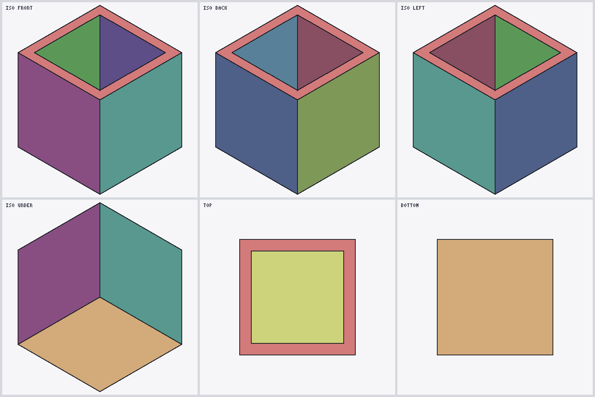

# SLDPRT format research

I'm reverse engineering SolidWorks `.SLDPRT` files because the format isn't documented anywhere and that pissed me off.

This repo is the code and the write-up. `sldprt` is a Node.js package and command line tool that reads part files without SolidWorks. It has no dependencies and needs Node 18 or newer. [`docs/`](docs/README.md) explains the format as far as we've worked it out, and every number in there was checked against real files.

Come talk about it on [Discord](https://discord.gg/vC4Jee5Q4n).

## What it reads

| part of the file | status | more |
|---|---|---|
| Modern container (SolidWorks 2015+) | reads it, checks every stream's CRC-32 | [container.md](docs/format/container.md) |
| Legacy OLE2 container (SolidWorks 2011) | reads it | [container.md](docs/format/container.md#legacy-container-ole2) |
| Display mesh: triangles, normals, which edges are face boundaries | modern and 2011 | [displaylists.md](docs/format/displaylists.md) |
| Surface type, parameters and bounding box per face | modern; bounding box on 2011 too | [displaylists.md](docs/format/displaylists.md#surface-record-modern) |
| The real Parasolid B-rep: topology, analytic surfaces, B-splines | modern and 2011, matches SolidWorks' own STEP export | [parasolid.md](docs/format/parasolid.md) |
| Link between the mesh and the B-rep | every face joined, in every version: by face ID, by edge IDs on 2011 and older, by geometry when there are no IDs (`sldprt link`) | [parasolid.md](docs/format/parasolid.md#the-join-with-the-display-mesh) |
| STL export | exact copy of the mesh saved in the file | [validation.md](docs/validation.md#stl-and-step-export-display-mesh) |
| STEP export | exact, written from the B-rep, for every part in the corpus that has a solid: the same solid as SolidWorks' own STEP on all 49 test models, and valid in OpenCascade on all 10 real parts, fillets and all | [validation.md](docs/validation.md#exact-step-export-b-rep) |
| Volume | exact, straight from the surfaces, no mesh involved | [parasolid.md](docs/format/parasolid.md#writing-it-back-out-as-step) |
| Feature tree, sketches, configurations, assemblies | not decoded | |
| Files older than 2011 | mesh and B-rep both read, including Parasolid 9 bodies from around 2000 | [container.md](docs/format/container.md#pre-2011-files) |

## Try it

```sh
git clone https://github.com/blussyya/sldprt-format-research
cd sldprt-format-research
node bin/sldprt.js info samples/sw2022/C04_cube_hole_5mm.SLDPRT
```

```
container   modern (SolidWorks 2015+), 62408 bytes
DisplayLists version 15000
streams     38
display     7 faces, 152 triangles (modern DisplayLists)
surface tags 4001×6  4002×1
partition   Contents/Config-0-GhostPartition: partition (complete)
partition   Contents/Config-0-Partition: partition + deltas (complete)
B-rep       186 nodes from Contents/Config-0-Partition: 1 body, 2 shell, 7 face, 10 loop, 14 edge, 8 vertex
surfaces    plane×6  cylinder×1
graph checks 367 run, 0 failed
```

There's nothing to `npm install`. Run `npm link` once if you want a `sldprt` command.

| command | what it does |
|---|---|
| `sldprt info part.SLDPRT` | shows what's in the file |
| `sldprt parse part.SLDPRT > mesh.json` | dumps the mesh and surface records as JSON |
| `sldprt convert part.SLDPRT --stl out.stl --step out.step` | exports (also `--ascii`, `--scale N`, and `--brep` or `--mesh` to force where the STEP comes from) |
| `sldprt brep part.SLDPRT` | the Parasolid body: node counts and graph checks (`--json`, `--nodes`, `--volume`) |
| `sldprt link part.SLDPRT` | which mesh face is which B-rep face, and how they were matched (`--json`, `--all`) |
| `sldprt render part.SLDPRT sheet.png` | six views of the part in one PNG |
| `sldprt view part.SLDPRT` | spins the part around in your terminal |
| `sldprt serve --open` | viewer in the browser; files are parsed on your machine and never uploaded |

`samples/` has four small parts to play with, three from SolidWorks 2022 and one from 2011.



That's a SolidWorks 2011 part, a cube shelled to 1 mm, read straight out of its legacy DisplayLists stream. The black lines are the edges the file marks as face boundaries.


Pocket Wheel: 400 faces, 17,078 triangles. That's exactly what the parser read. Nothing welded or patched.


### From code

```js
const fs = require('fs'), sldprt = require('./src');   // or require('sldprt')

const mesh = sldprt.parse('part.SLDPRT');      // per face: vertices, triangles, edge IDs, surface type
const body = sldprt.readBrep('part.SLDPRT');   // the Parasolid nodes plus graph checks
fs.writeFileSync('part.stl', sldprt.toSTL('part.SLDPRT'));
fs.writeFileSync('part.step', sldprt.toSTEP('part.SLDPRT').text);   // exact when it can be
sldprt.volume('part.SLDPRT').volume;           // m³
```

The mesh reader also runs in a browser. See [docs/api.md](docs/api.md).

## How do we know it's right

There's a test corpus of 73 part files. 49 of them were built just for this project, in SolidWorks 2011 and 2022, to sizes picked before building them. SolidWorks exported each one to STEP, STL, X_T and X_B and wrote down the surface type of every face. The full numbers are in [validation.md](docs/validation.md). The main ones:

- All 73 files parse to exactly the recorded output (1,559 faces).
- Face counts match what SolidWorks reports on every controlled model, in both versions.
- Surface types match SolidWorks on 136 of 136 faces.
- The Parasolid body we pull out of the file matches the STEP file SolidWorks exports from the same part, on all 49 controlled models. Every vertex, edge and face lines up, and the B-spline control points are identical. The worst difference is 9×10⁻¹⁸ m, which is just floating-point rounding ([EXP-075](https://github.com/blussyya/sldprt-research-dump/blob/staging/knowledge/evidence/2026-10-03_v0.5-EXP075.md)).
- Every real part with a solid, ten of them from around 2000 to 2022, exports exact STEP that OpenCascade reads as one valid solid. That includes intersection curves, fillets, the swept surfaces on the ornamental panel and edges stored per face. Every mesh vertex that's off its surface turns out to be a chord point on the face boundary, apart from a hundred-odd interior vertices out of 60,000 ([EXP-078](https://github.com/blussyya/sldprt-research-dump/blob/staging/knowledge/evidence/2026-10-04_v0.5-EXP078.md)).
- The STEP we write from that body is the same solid as SolidWorks' STEP on all 49. OpenCascade reads every file as one valid solid, and subtracting one from the other leaves nothing in either direction. Volumes match to 15 decimal places, and match the hand-worked values for the cubes, holes, cone, sphere, torus and crossed cylinders ([EXP-076](https://github.com/blussyya/sldprt-research-dump/blob/staging/knowledge/evidence/2026-10-03_v0.5-EXP076.md)).
- Our STL has the exact same bounding box as SolidWorks' STL on all 13 controlled cubes. SolidWorks' own STL of three of them is missing a whole face. Ours isn't.

To run the tests yourself you need the corpus, which lives in the dump repo:

```sh
git clone https://github.com/blussyya/sldprt-research-dump ../sldprt-research-dump
npm test
```

Without it, the tests that need the corpus show up as skipped.

## What it can't do yet

- Intersection curves and fillets (rolling-ball blends) go into STEP as B-splines, within a nanometre and 10 nanometres of the real thing. STEP has no exact type for them, so every exporter does this, SolidWorks' included.
- The feature tree isn't decoded, so what you get in another CAD program is the solid, not the history. The ghost partition (the sketch profiles some features use) is the first piece of that.
- It only reads. It can't write SLDPRT.
- It's tested on 2011 and 2022 files plus 21 real parts whose version nobody recorded. Other versions probably work, but I haven't proven that.
- Single parts only. No assemblies, drawings or feature history. The history is stored as serialised objects whose class names you can read, but none of their fields are decoded.
- Input size is capped (128 MiB, 2 million vertices, 50,000 faces) and broken data gets rejected, but nobody has done a security audit.

## What's where

```
bin/sldprt.js         the command line tool
src/
  container/          modern.js (stream scan, CRC), ole.js (legacy reader)
  display.js          the mesh reader, runs in Node and the browser
  inflate.js          zlib for the browser
  parasolid/          partition.js, xt.js (Parasolid reader), topology.js
  brep/               native.js (the body as vertices, edges, faces), intersection.js, blend.js,
                      fit.js, seams.js, volume.js, compare.js
  link.js             the mesh joined to the B-rep
  step/               read.js, write.js (exact STEP)
  geom/               curve, surface and NURBS maths
  convert.js          STL and mesh STEP
  render.js           the six-view PNGs
  terminal-viewer.js  sldprt view
  serve.js            sldprt serve
web/                  browser viewer
samples/              four small parts
test/                 the tests, plus fixtures/display-golden.json
docs/                 how the format works, validation, history, open questions
```

## The research

The whole lab notebook is in [sldprt-research-dump](https://github.com/blussyya/sldprt-research-dump). Every experiment from EXP-001 to EXP-078 is there with its script, raw output and later corrections, along with the test corpus and every old parser and converter. This repo keeps only the current code and the cleaned-up results.

If you want the story in one page, including all the stuff we got wrong along the way, read [docs/history.md](docs/history.md).

## License

MIT. The Parasolid part follows the public *Parasolid XT Format Reference* (2006). No SolidWorks or Parasolid source code, binaries or SDK files are used.
