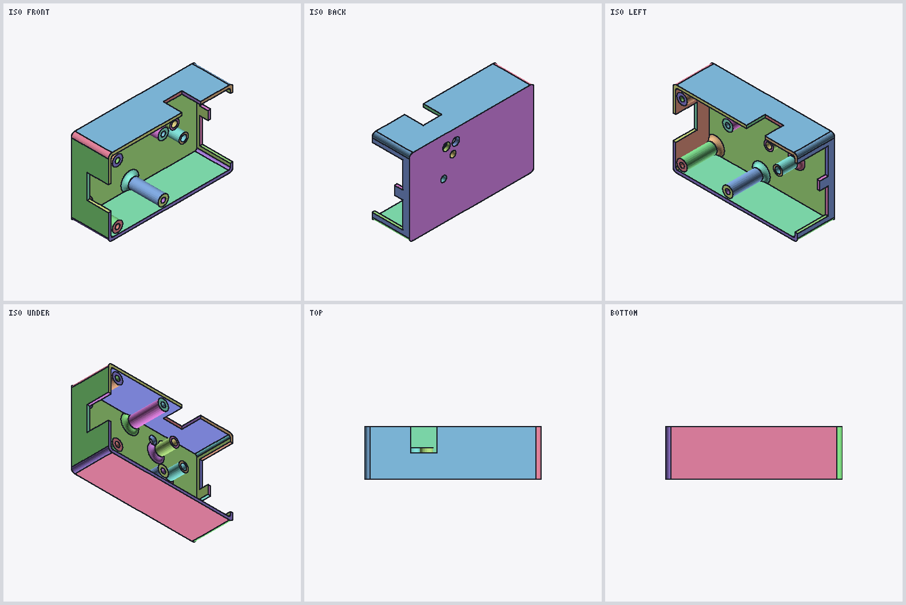
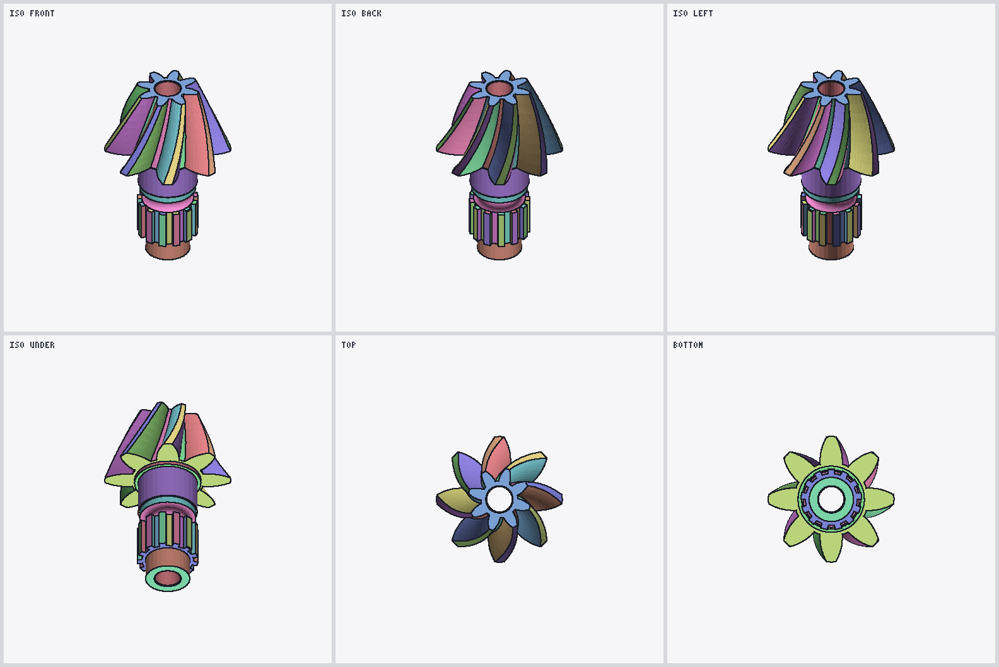

# DisplayLists: the saved tessellation

`Contents/DisplayLists` (modern) and `DisplayLists__ZLB` (SolidWorks 2011) hold the triangle mesh
SolidWorks drew the part with, one record per B-rep face, followed by a record describing that
face's surface. The same per-face grammar is used by both containers and by every declared
DisplayLists version in the corpus (13000–17000).

Reader: [`src/display.js`](../../src/display.js). All integers are little-endian `u32`;
coordinates are `float32` in **metres**; surface parameters are `float64`.

What it gives you: exact display triangles with normals, which triangle edges lie on a face
boundary and which B-rep edge they belong to, an analytic bounding box per face, and the face's
surface type with its parameters for planes, cylinders and cones. What it does not give you: exact
curved geometry. The mesh approximates curved surfaces, so for exact geometry use the Parasolid
body ([parasolid.md](parasolid.md)), which this record links to by ID.



*USB hub case top: 68 faces read straight from DisplayLists. Black lines are the Block1 boundary
edges. Rendered with `sldprt render`.*

---

## Typed arrays

Every array in the record starts with a 16-byte header `[stride, kind, 2, count]`, then
`stride × count` bytes. The combinations seen:

| header | element |
|---|---|
| `[4, 8, 2, n]` | u32 |
| `[1, 8, 2, n]` | u8 |
| `[12, 100, 2, n]` | float32 × 3 |
| `[4, 100, 2, n]` | float32 |
| `[8, 100, 2, n]` | 8-byte elements (only in the surface record; payload kept raw) |

The third word is `2` everywhere. These are descriptive names for what was measured, not a claim
about SolidWorks' own type system.

## Face record

The stream begins with `u32 [1, 1]`. Face records are found by scanning for the strip-length
header `[4, 8, 2, S]` and reading forward; every structural check below must pass or the
candidate is rejected (and reported) rather than repaired.

| order | header | body | name |
|---|---|---|---|
| 1 | `[4, 8, 2, S]` | `u32[S]` = L | strip lengths |
| 2 | `[12, 100, 2, V]` | `float32[V][3]` | positions |
| 3 | `[12, 100, 2, V]` | `float32[V][3]` | normals, unit length |
| 4 | `[4, 8, 2, N]` | `u32[N]` | Block1: edge annotations |
| 5 | `[4, 8, 2, S]` | `u32[S]` | Block2: Block1 section lengths |
| 6 | `[1, 8, 2, N]` | `u8[N]` | Block3 |
| 7 | — | 132 bytes | bounding record |
| 8 | — | variable | surface record (modern only) |

`S` strips, `L[i]` vertices in strip `i`, `V` vertices, `N` Block1 words. They satisfy, with no
exception on 11,515 strips in 45 modern files:

```
V     = sum(L)            every L[i] >= 3
B2[i] = 2·L[i] − 2
N     = sum(B2) = 2·(V − S)
```

**Block2 carries no information of its own.** It is fully determined by the strip lengths
([EXP-061](https://github.com/blussyya/sldprt-research-dump/blob/main/knowledge/evidence/2026-09-21_v0.4.9-EXP061.md)).
It is the table of Block1 section lengths.

**Block3** has one byte per Block1 word. All 122,142 bytes in the original corpus are zero; its
meaning is unknown, and the reader warns if it ever sees a nonzero byte.

### Triangles

Each strip is an ordinary triangle strip over its own vertices. With vertex base `v` and strip
length `n`:

```
i = 2, 4, 6, …   triangle (v+i−2, v+i−1, v+i)
i = 3, 5, 7, …   triangle (v+i−1, v+i−2, v+i)
```

Reset the base and the winding parity at every strip. Do not join strips and do not fan from the
first vertex. All 50,976 strip triangles in the original corpus agree with the stored normals; a
fan reading fails on the controlled models. A "strip" is a tessellation unit: a face with a hole
can be twelve strips and two boundary cycles, and Dekor's large faces have 121 boundary cycles
each. Strip count is not a loop count.

### Block1: which edges are face boundaries

Each strip's section is one control word, `1` on every strip in the corpus, then one word per
strip edge, in this order:

```
ID(0,1),
ID(0,2), ID(1,2),
ID(1,3), ID(2,3),
ID(2,4), ID(3,4), …
```

Each new vertex adds two edges, so a strip of `n` vertices has `2n − 3` edges, and with the
control word its section is `2n − 2` words long, which is Block2's entry.

- `0` marks an edge inside the face (a triangulation diagonal).
- A nonzero value marks an edge on the face boundary, and **is the Parasolid `node_id` of the
  B-rep edge it lies on**. Every nonzero ID in a part is shared by exactly two faces.

Measured: 41,010 boundary annotations are all nonzero and 71,037 interior ones are all zero.
Shuffling the edge order within each strip, while keeping the tokens, produces 44,640 exceptions,
so the order above is load-bearing
([EXP-049](https://github.com/blussyya/sldprt-research-dump/blob/main/knowledge/evidence/2026-09-15_v0.4.8-EXP049.md)).
The words are `u32`: read as `float32`, all 162,018 of them are below 1e-30.

Use Block2's lengths to delimit sections. Do not treat every `1` as a separator: nothing
guarantees an edge ID can never be 1.



*Helical bevel gear, 113 faces. The gaps between the teeth are real geometry, not missing faces:
all 32 open edges in this mesh are collinear with another open edge, which is the
different-sampling effect described below.*

### Boundary cycles

Taking only the nonzero-annotated edges and joining vertices with exactly equal coordinates gives
a graph in which every vertex has degree two, on every face in the corpus. Its components are the
face's boundary cycles (1,698 cycles on 1,272 faces). They are display polylines: the reader does
not decide which is the outer boundary, and does not weld vertices.

Adjacent faces can sample their shared edge differently. 389 of 3,278 shared edge IDs have
different vertex samples on the two sides, always collinear (the largest measured offset is
8.3e-9 m). Coordinate-exact welding therefore leaves some open edges on curved models even though
nothing is missing. The 13 controlled cubes are closed under exact matching.

---

## Bounding record (132 bytes)

Directly after Block3, in both containers:

| offset | type | field |
|---|---|---|
| +0 | u32 × 3 | `0, 0, 1` on all 1,414 modern faces; meaning unknown |
| +12 | float64 × 3 | centre |
| +36 | float64 × 3 | maximum corner |
| +60 | float64 × 3 | minimum corner |
| +84 | float64 | radius, the distance from centre to a corner |
| +92 | 40 bytes | not decoded |

The centre is the exact midpoint of the corners and the radius is exactly the corner distance on
every face (below 1e-12), and `min ≤ max` on 1,461/1,461 modern and 145/145 legacy records. The
box is the **analytic** box of the face, not the box of its mesh: it contains the mesh and is
almost never equal to it. Whole-part box unions match STEP geometry within 1 nm on 23 of 24
modern controlled models. The exception is the spline loft C16, padded by about 10.4 µm on every
side, so spline boxes are not guaranteed tight
([EXP-061](https://github.com/blussyya/sldprt-research-dump/blob/main/knowledge/evidence/2026-09-21_v0.4.9-EXP061.md),
[EXP-063](https://github.com/blussyya/sldprt-research-dump/blob/main/knowledge/evidence/2026-09-21_v0.4.9-EXP063.md),
[EXP-064](https://github.com/blussyya/sldprt-research-dump/blob/main/knowledge/evidence/2026-09-21_v0.4.9-EXP064.md)).

The same layout also occurs once per configuration elsewhere in the stream, preceded by the
configuration name in UTF-16LE (45/45 modern files). What that box is used for is open.

---

## Surface record (modern)

Starting 132 bytes after Block3 (that is, right after the bounding record), read forward:

| step | content |
|---|---|
| 1 | typed array `[8, 100, 2, K]`; empty except on eight distributor faces (K = 50, 54), kept raw |
| 2 | `u32`, `1` throughout the corpus |
| 3 | typed array `[12, 100, 2, A]`, empty throughout the corpus |
| 4 | typed array `[12, 100, 2, B]`, empty throughout the corpus |
| 5 | `u32 scalarFlag`: `0`, or `1` followed by two `[4, 100, 2, V]` float32 arrays, one value per vertex |
| 6 | `u32 × 3`, zero throughout the corpus |
| 7 | `u32` **face ID** = the Parasolid FACE `node_id` |
| 8 | `float64 × 3` direction |
| 9 | `u32` **surface type tag** |
| 10 | `float64 × 8` parameters |
| 11 | `u32` edge count, then that many `(u32 edge ID, u32 edge type tag)` |

Do not read the tag at a fixed offset: the empty-or-not arrays in steps 1, 3, 4 and 5 move it.

**Edge table.** Its ID set equals the face's nonzero Block1 IDs, and equals the set of Parasolid
edges bounding the face. The reader refuses a populated table that disagrees with Block1. One
documented exception: a part saved in SolidWorks 2011 and re-saved in 2022 (C23) has an **empty**
table on every face while Block1 still carries the IDs. The reader keeps the surface record and
warns. Edge type tags are kept raw; they are not decoded.

**Optional per-vertex arrays.** 390 faces carry the two float32 arrays of step 5. On four cone
faces they behave as an angle in radians and a negative axial distance; in general their meaning is
open.

### Surface type tags

| tag | surface | established by |
|---|---|---|
| 4001 | plane | SolidWorks' own per-face report, controlled models |
| 4002 | cylinder | same |
| 4003 | cone | same |
| 4004 | sphere | same |
| 4005 | torus | same; a 90° torus is still 4005, so the tag is the surface type, not the trimmed patch |
| 4006 | B-surface (spline) | same |
| 4007 | blend (Parasolid `BLENDED_EDGE`) | ID join to the native body, 33/33 faces in two production parts |
| 4009 | swept surface (Parasolid `SWEPT_SURF`) | ID join to the native body, 311/311 faces in one production part |

4001–4006 agree with SolidWorks on 136/136 faces of the natively authored 2022 models
([EXP-055](https://github.com/blussyya/sldprt-research-dump/blob/main/knowledge/evidence/2026-09-21_tag-identification-EXP055.md)),
and every tag maps to exactly one native surface type on all 1,414 modern faces
([EXP-074](https://github.com/blussyya/sldprt-research-dump/blob/main/knowledge/evidence/2026-09-29_v0.4.9-EXP074.md)).
4007 and 4009 rest on production parts, not on a purpose-built model.

### Surface parameters

Checked against independently exported STEP geometry:

| tag | direction | parameters |
|---|---|---|
| 4001 plane | the plane normal, up to sign | **not** an origin: all eight are zero even on displaced faces |
| 4002 cylinder | the axis | slots 0–2 a point on the axis, slot 6 the radius |
| 4003 cone | the axis | slots 0–2 a reference point on the axis, slot 6 the radius there, slot 7 the half-angle in radians; apex = point + axis · radius / tan(angle) |

Other tags' parameters are kept raw. For exact geometry of any face, follow the face ID to the
Parasolid body.

---

## Legacy (SolidWorks 2011)

The 25 SolidWorks 2011 models use the identical face record and bounding record. Their geometry
was checked against dimensions fixed before the models were built (7/7 boxes), against the
geometry-matched 2022 models (22/22 boxes) and against their own bounding records (145/145)
([EXP-066](https://github.com/blussyya/sldprt-research-dump/blob/main/knowledge/evidence/2026-09-22_v0.5-EXP066.md)).
What follows the bounding record has a different grammar that is not decoded. The reader returns
those bytes raw (`legacyTail`), and legacy faces have no surface record, so they have no face ID or
surface tag. The native body in the same file still has both.

## Pre-2011

Two older variants of the same face record, both read now ([EXP-077](https://github.com/blussyya/sldprt-research-dump/blob/staging/knowledge/evidence/2026-10-03_v0.5-EXP077.md)):

- **chainwheel** (`DisplayLists__Zip`, PKWARE-compressed). The SW2011 record, plus two arrays
  between Block3 and the bounding record: one with a 12-byte stride and kind 100, one with an
  8-byte stride and kind 8, both empty on all 189 faces. The reader skips them and reports their
  counts as `extraArrays`. 276 strips have **control 0** instead of 1. Every one of them is a
  3-vertex strip, a single triangle, so the geometry is the same either way; what else the value
  means is open.
- **plate4** (uncompressed `DisplayLists`, Parasolid 9 era). Strip lengths, positions and normals,
  then straight into the bounding record: no Block1, Block2 or Block3, so no edge IDs. The record
  starts with the u32 values 0, 1, 1 and has the box and sphere at the usual offsets (12, 36, 60,
  84). Faces from this layout carry `noEdgeTable: true`.

Checks: face counts equal the native body's (189/189, 14/14); every bounding record validates;
plate4's mesh has the body's exact box and its volume to float32 rounding. On chainwheel, 3,768
of 4,658 vertices lie on a B-rep surface within 1 µm; 833 of the other 890 sit on boundary edges,
the chord points already seen in modern files. 57 interior vertices up to 36 µm off are not
explained yet.
