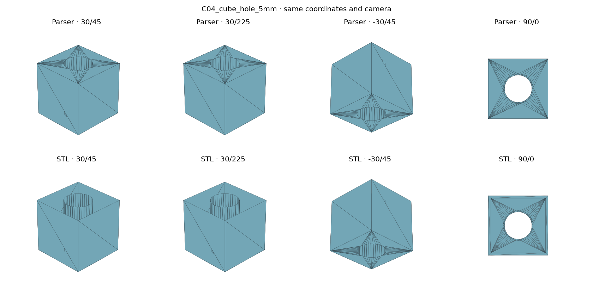
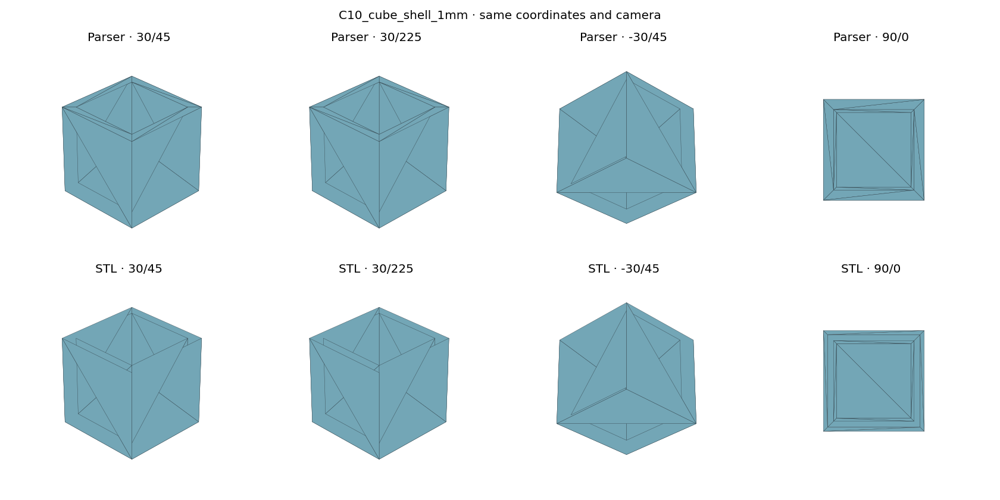

# v0.3 web and reference checks — 2026-09-21

## Application checks

- `test/http.js`: starts the shipped server and verifies HTTP 200/nonempty responses for the page, worker, all parser imports, bundled previews and legacy sample (8 assets).

- `test/worker.js`: parses the shipped worker/import graph in isolated JavaScript contexts, returning 11 faces for a legacy shell, 1 face for a modern torus, and an explicit unsupported-stream error for SW2000-s01. It also compiles the inline page script.
- `test/validate.js`: 73 input comparisons between Node zlib and the exact browser inflater; all parser results agree. Corrupt Adler checksums and truncated streams fail.
- `test/browser.js`: authored for real Chromium file selection, drop handling, PNG export and failed-load behavior. **Not successfully executed here**: Chromium was absent, Playwright download timed out, and the system package manager could not initialize. Therefore browser interactions and new WebGL rendering are unverified in this environment.
- The UI is adapted from the existing handwritten WebGL viewer. Sheet viewpoints and rendering math are retained. Parsing is asynchronous in a cancellable worker; resource limits and diagnostics are added. This is implementation evidence, not browser-test evidence.

## Independent STL comparison

`test/compare-stl.py` invokes the parser, independently reads binary STL triangles, converts millimetres to metres, and compares bounds, areas and up to 256 deterministic vertex/centroid samples in each direction using Euclidean point-to-triangle distances. Hashes, units and per-model numbers are retained in `test/STL_RESULTS.json`. These sampled maxima are **not** a full Hausdorff bound.

No transform is applied to the primary raw comparison. A secondary diagnostic rounds the bounding-centre displacement to whole millimetres and reports its translation vector and separate distances. It is an explicit alignment hypothesis, not a proven export setting; it changes no parser output.

C00/C01/C02/C18/C22 agree directly within about 2e-9 m in this sampled check. Several curved exports differ in origin; after the documented candidate translation, cone/sphere/torus/loft/half-cylinder comparisons are approximately 6–16 micrometres. Other cases retain substantial disagreement and must not be labelled passed.

A concrete reference deficiency is visible on **C04_cube_hole_5mm**: the parser has **38 triangles on z=0.01 m**, whereas the STL has **zero** on that plane (1e-8 m plane tolerance). The opposite plane has 38 parser versus 44 STL triangles. Identical cameras show the top cap present in DisplayLists and absent from the supplied STL; sample distances from parser to reference therefore remain large. The test reports outer-plane counts for each model so this observation is reproducible. This does not resolve every other discrepancy.

The images below are **Matplotlib geometry comparisons**, not browser screenshots. Regenerate with `python3 parser/v0.3/test/compare-stl.py --render`.

Further work: real Chromium interaction testing, independent STEP surface coverage for remaining discrepancies, older array layouts, and legacy metadata grammar. The current support claim is validated saved-mesh extraction on the specified corpus, not exact CAD reconstruction or universal compatibility.
