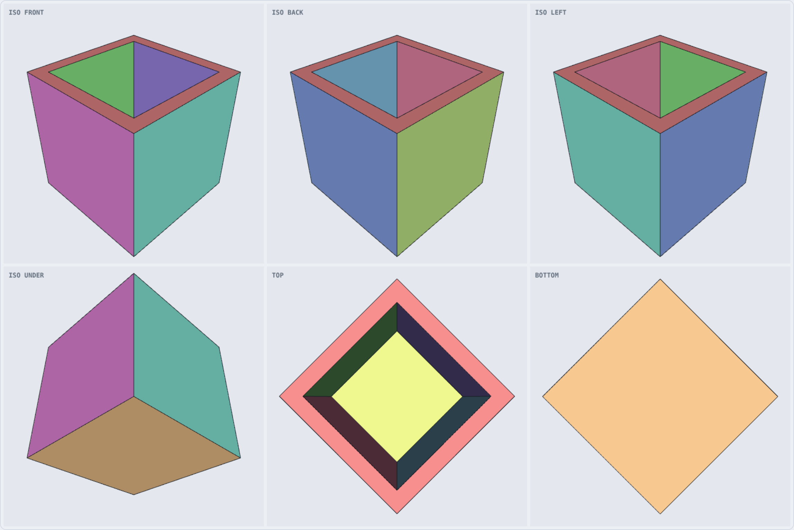

# viewer/ — interactive viewers for parser output

Two ways to look at what `parser/v0.2` emits, plus the pieces that let the parser run in a
browser. No dependencies, no build step.

| file | what it is |
|---|---|
| `cli-viewer.js` | Interactive terminal viewer (ANSI truecolor) |
| `serve.js` | Zero-dependency static server for the browser viewer |
| `web/index.html` | Interactive browser viewer (hand-written WebGL) |
| `inflate.js` | Synchronous DEFLATE/zlib decoder, so the parser runs client-side |
| `test-inflate.js` | Verifies `inflate.js` against Node's zlib |
| `export-mesh-data.js` | Builds the browser viewer's pre-parsed geometry payload |
| `mesh-data.js` | That payload — seven models |
| `renders/` | Screenshots used in the READMEs |

## Terminal viewer

```bash
node viewer/cli-viewer.js "test files original/controlled/C10_cube_shell_1mm/model.SLDPRT"
```


Rendering uses ANSI truecolor and the half-block `▀`: the foreground colour paints the upper
pixel, the background the lower, so one character row is two pixels and the raster is
`columns × rows×2`. The rasteriser matches EXP-051 — orthographic, z-buffer, flat shading from
the geometric face normal, one hue per face index, INV-021 boundary edges overlaid — so the
terminal and the committed PNG sheets agree.

| key | action |
|---|---|
| arrows or `h` `j` `k` `l` | orbit |
| `+` `-` | zoom |
| `e` | boundary edges |
| `c` | colour by face |
| `r` | reset view |
| `q` | quit |

Flags: `--still` (one frame, no input — works when piped), `--dark`, `--edges` / `--no-edges`.

**On the edge overlay.** A terminal row is two pixels, so a typical window gives a raster only
~80 pixels tall and a 1-pixel edge line covers a large fraction of every face. The overlay
therefore defaults on only when the window is tall enough to resolve it (≥55 rows); `e` and the
`--edges` / `--no-edges` flags override, and the status bar always shows the current state.

## Browser viewer

```bash
node viewer/serve.js --open
```

Starts a local web server and opens `http://localhost:8080/viewer/web/index.html`.
`serve.js` uses only Node's built-in `http` and `fs`: no dependencies, no build step, nothing
installed. Flags: `--port N`, `--host 0.0.0.0` (default is localhost only), `--open`.

It serves the **repository root** on purpose. `web/index.html` loads the repository's own files
by relative path — `../mesh-data.js`, `../inflate.js`, `../../parser/v0.1/src/parser-core.js`,
`../../parser/v0.2/src/parser-core.js` — so the page runs against the same parser source as the
CLI tools, with no duplicated copies to drift. Opening the file directly over `file://` works
too, for the same reason.

Regenerate the geometry payload after a parser change:

```bash
node viewer/export-mesh-data.js     # rewrites viewer/mesh-data.js
```



**Drop a `.SLDPRT` onto the view** and it is parsed client-side — nothing is uploaded. The
readout updates and the status line reports faces, triangles, boundary edges and parse time, or
the parser's own error if the file cannot be read. That is the point: it is a way to check the
parser against a file it has never seen. Legacy OLE2 parts correctly report
`No readable modern DisplayLists stream`.

**Export 6-view sheet** renders the EXP-051 viewpoints (ISO front/back/left, ISO under, top,
bottom) into a single PNG. The artifact sandbox blocks a page from starting a download, so the
sheet appears inline for right-click → *Save image as…*. For files on disk, use the CLI sheet
renderer instead: `node v0.4.8/exp051_render_validation.js --sheet <model.SLDPRT>`.

## Running the parser in a browser

`parser/v0.1` takes its decompressors by injection to stay isomorphic; Node passes
`zlib.inflateRawSync` and `zlib.inflateSync`. Browsers have no synchronous equivalent —
`DecompressionStream` is async — so `inflate.js` supplies one (RFC 1951 + RFC 1950, canonical
"puff"-style decoding, ~150 lines, no dependencies).

It is verified rather than assumed:

```bash
node viewer/test-inflate.js
```

- 176 round-trips against `zlib.deflateRawSync` / `deflateSync` at levels 0/1/6/9, over empty,
  single-byte, highly repetitive, repeated-text and randomised input, to exercise stored, fixed
  and dynamic Huffman blocks.
- Every SLDPRT in the corpus decompressed both ways and compared byte for byte:
  **21 streams, 3,892,180 bytes, 0 differences.**
- Every one of those files parsed twice, once per decoder, and the complete parser output
  compared: **0 differences.**
